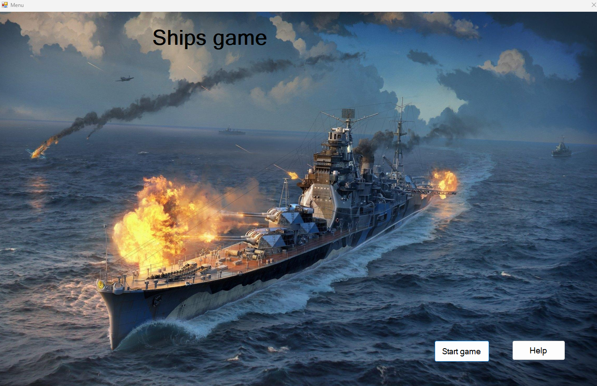
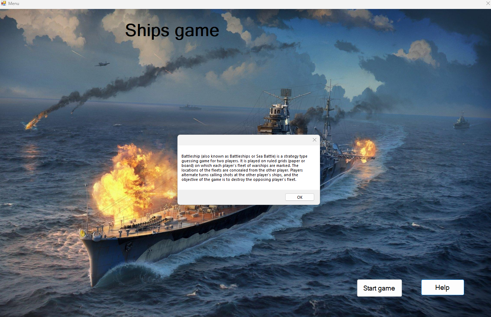
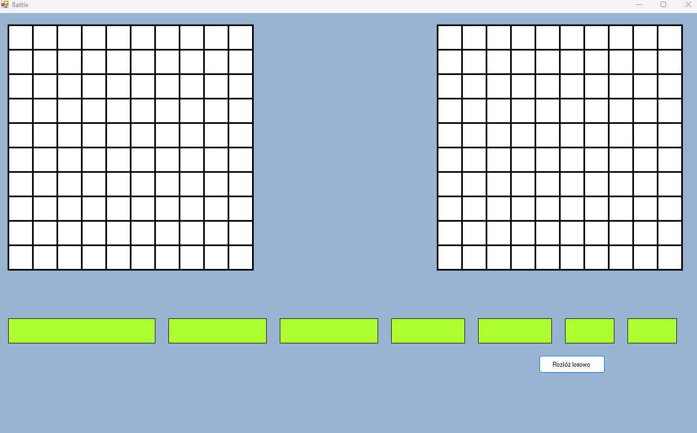
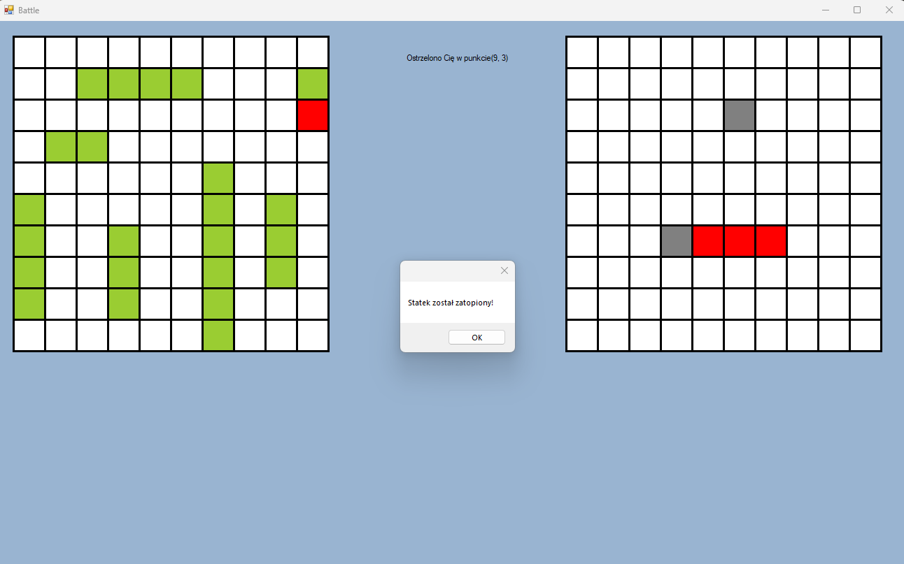
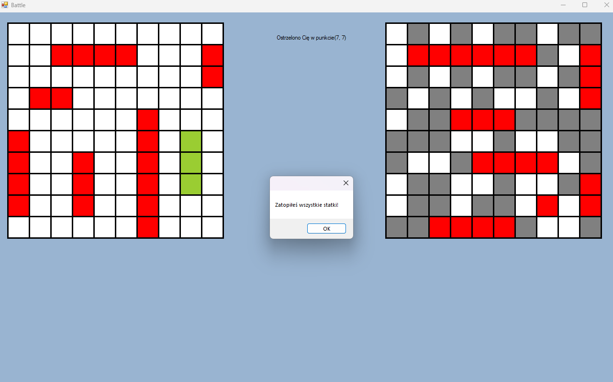

# Ships Battlegame GUI

**ShipsBattlegameGUI** is a simple and classic Battleship game built using **C#** and **WinForms**, where a human player competes against a computer opponent. The objective is to sink all enemy ships before yours are destroyed.

---

##  Gameplay

- Place your ships strategically or use the **Random Placement** button.
- You see two boards:
  - **Left**: Your fleet.
  - **Right**: The enemy grid – this is where you shoot!
- The game ends when all ships of one side are sunk.

---

### Main Menu  

### Help Section – Rules and Controls  

### Game Start – Ready for Battle  

### During Battle – Choose where to strike!  

### Victory Screen – Sink or be sunk!  

---

## Built With

- **C#**
- **WinForms (.NET Framework)**
- **Visual Studio**

---

